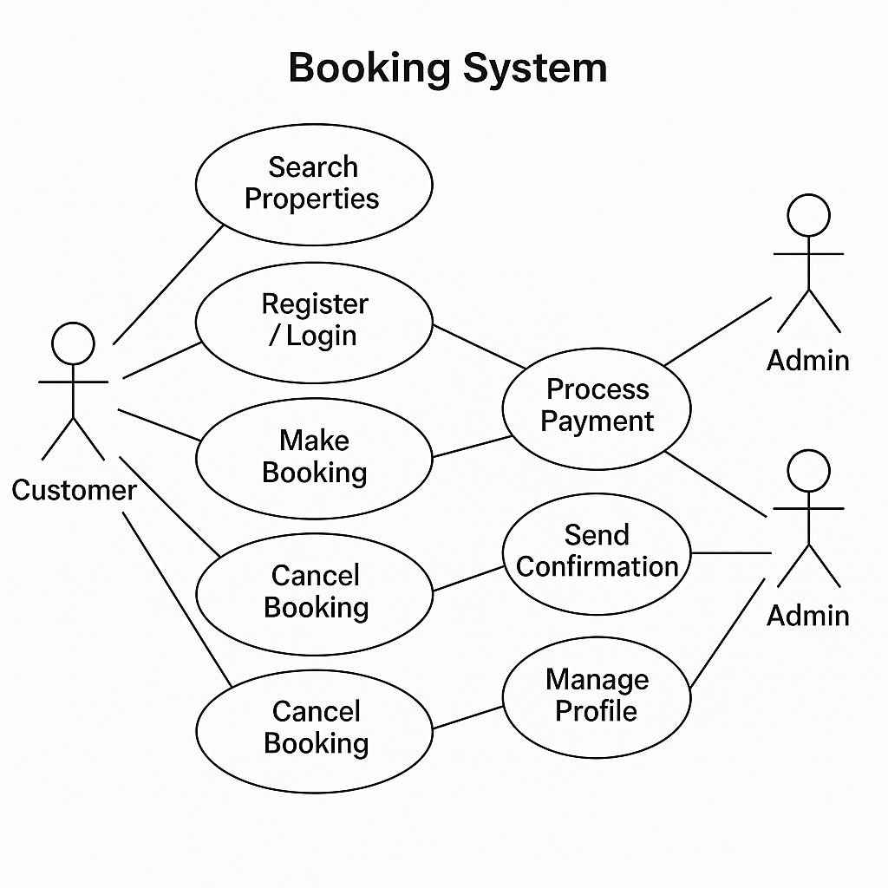

# Requirement Analysis in Software Development

This repository is dedicated to exploring **Requirement Analysis**, an essential phase in the Software Development Lifecycle (SDLC).  
The purpose of this repository is to document the concepts, importance, activities, and practical examples of Requirement Analysis, including diagrams and acceptance criteria for a booking management system case study.

## What is Requirement Analysis?
Requirement Analysis is the process of identifying, documenting, and validating the needs and expectations of stakeholders for a software system. It ensures that the development team fully understands what must be built before the design and implementation phases begin.  

In the Software Development Lifecycle (SDLC), requirement analysis acts as the foundation—it bridges the gap between stakeholders (clients, end-users, management) and the technical team. A well-conducted requirement analysis reduces misunderstandings, prevents costly rework, and ensures the delivered system aligns with business goals.  

---

## Why is Requirement Analysis Important?
Requirement Analysis is critical in SDLC for several reasons:

1. **Clarity and Alignment**  
   It establishes a clear understanding between stakeholders and developers, reducing ambiguity and preventing misinterpretations.  

2. **Risk Reduction**  
   Identifying requirements early helps uncover potential risks, missing functionality, and constraints before development starts.  

3. **Efficient Resource Utilization**  
   Accurate requirements ensure that time, budget, and human resources are directed toward building features that actually matter to the business.  

---

## Key Activities in Requirement Analysis
Requirement Analysis typically involves the following key activities:

- **Requirement Gathering**  
  Collecting information from stakeholders, documents, and existing systems.  

- **Requirement Elicitation**  
  Engaging stakeholders through interviews, workshops, and questionnaires to uncover explicit and hidden needs.  

- **Requirement Documentation**  
  Recording the requirements clearly in formats like Software Requirement Specifications (SRS).  

- **Requirement Analysis and Modeling**  
  Analyzing requirements for feasibility, consistency, and completeness. Creating models like use case diagrams, data flow diagrams, etc.  

- **Requirement Validation**  
  Reviewing and confirming requirements with stakeholders to ensure they accurately represent user needs.  

---

## Types of Requirements

### Functional Requirements
Functional requirements describe *what the system should do*. They define specific behaviors, actions, or functions of the system.  

**Examples (Booking Management System):**
- The system must allow users to search for available rooms.  
- The system must allow customers to create, update, and cancel bookings.  
- The system must send email notifications when a booking is confirmed.  

### Non-functional Requirements
Non-functional requirements describe *how the system should behave*. They focus on quality attributes, constraints, and performance standards.  

**Examples (Booking Management System):**
- The system should handle at least 10,000 concurrent users.  
- The response time for booking confirmation should not exceed 3 seconds.  
- The system should ensure secure payment processing with encryption.  

---

## Use Case Diagrams
Use Case Diagrams are visual representations of interactions between users (actors) and a system. They help in understanding functional requirements by showing who will use the system and what actions they can perform.  

**Benefits:**
- Provide a clear and simple view of system functionality.  
- Serve as a communication tool between technical and non-technical stakeholders.  
- Help identify missing or redundant requirements.  

**Booking System Use Case Diagram:**  

 

---

## Acceptance Criteria
Acceptance Criteria are predefined conditions that a software feature must meet to be accepted by stakeholders. They provide a clear definition of “done” and ensure everyone has a shared understanding of the expected outcome.  

**Importance of Acceptance Criteria:**
- Prevents ambiguity by specifying exact behaviors.  
- Acts as the basis for testing and validation.  
- Aligns developers, testers, and stakeholders on the expected results.  

**Example – Checkout Feature (Booking Management System):**
- The user must be able to select a payment method (credit card, PayPal, or mobile money).  
- The system must validate payment information before processing.  
- A confirmation message with booking details must be displayed after successful payment.  
- An email receipt must be sent automatically to the customer.  

---

